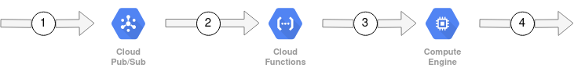

## How does it work?




1. Pipeline message is published to PubSub (`task-pipeline`).
2. New pipeline message triggers a Google Function (`create_vm`).
3. Google Function deploys new Google Compute (VM) based on `vm` section pipeline message (see [Pipeline Schema](#pipeline-schema))
   
> Environment Variables that are set in the VM are originally defined in Google's Secret Manager, passed as environment variables to the Google Function and then specific VM environment variables are hard coded in the deploy script (see `startup-script` section in [scl-orchestration-vm.jinja](functions/create_orchestration_vm/scl-orchestration-vm.jinja)).

> [Task orchestration](https://github.com/SpeciesConservationLandscapes/task_orchestration) is used to manage the execution of the pipeline.  Each task is ran in a docker container in the order defined by the `tasks` section of the pipeline message (see [Pipeline Schema](#pipeline-schema)).  All VM environment variables are available in each running task docker container.

4. After pipeline tasks have completed the VM is terminated.

## Google's Secrets Manager


At a minimum the following secrets need to be defined:

`SERVICE_ACCOUNT_KEY=<Service account for specific Google project>`

**NOTE: If more secrets are added, the pubsub event function will need to be redeployed.**


## Local environment files

There should be 2 environment files one for each Google project:

1. `.env_scl3`
2. `.env_hii`

And in each environment file the following variables should be defined:

```
SERVICE_ACCOUNT_KEY=<Service account for specific Google project>
```

## Deployments

When deploying to a specific Google Project, replace `[PREFIX]` with:

`hii`: HII Google Project (ex: `make hii_deploy_pubsub`)
`scl3`: SCL3 Google Project (ex: `make scl3_deploy_pubsub`)

**Deploy PubSub Topic:**

`make [PREFIX]_deploy_pubsub`

**Deploy PubSub Event Function:**

`make [PREFIX]_deploy_pubsub_function`

**Delete PubSub Topic:**

`make [PREFIX]_delete_pubsub`

**Delete PubSub Event Function:**

`make [PREFIX]_delete_pubsub_function`

**Run Sample Pipeline:**

`make [PREFIX]_publish_sample`


## Pipeline Schema


```
{
    "vm": {
        "machine-type": string (defaults: "e2-micro"),
        "disk-size-gb": integer (defaults: 10),
        "zone": string (defaults: "us-central1-f")
    },
    "tasks": [
        [
            {
                "image": string,
                "cmd": string,
                "args": object
            }
        ]
    ]
}
```